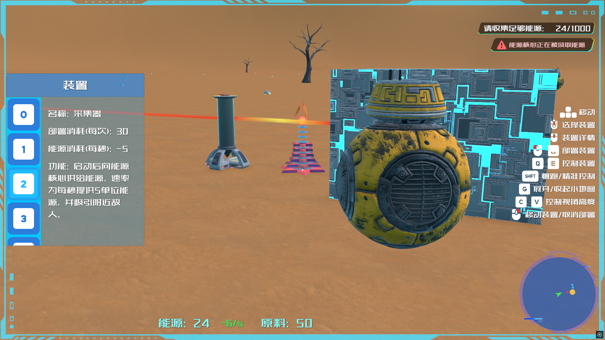
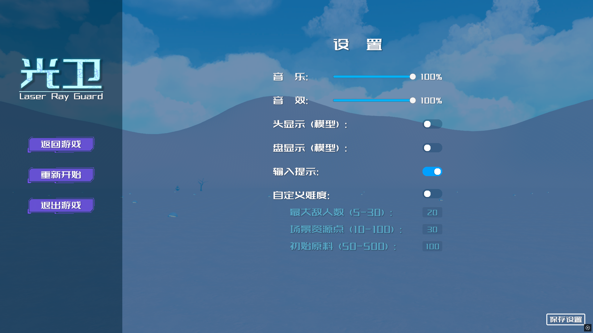
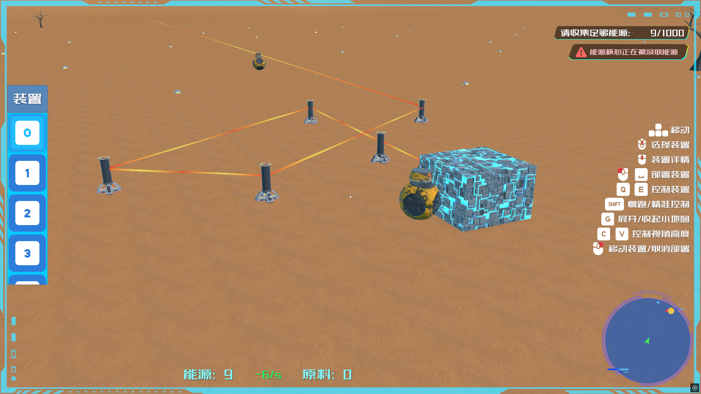
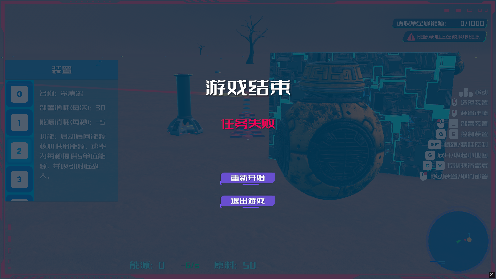

# LaserRayGuard
一个3D塔防游戏Demo，使用Unity3D制作。
# 介绍
### 基于Unity3D的塔防游戏，用于练手，后续可能会更新。
`策略` `塔防` `资源管理` `科幻`
## 游戏主界面

## 游戏内画面
  
   
  
  
# 下载
- 下载游戏Demo [**LaserRayGuard_Demo_v24.1.zip**]()
- 下载Unity资源 [**LaserRayGuard.unitypackage**]()
