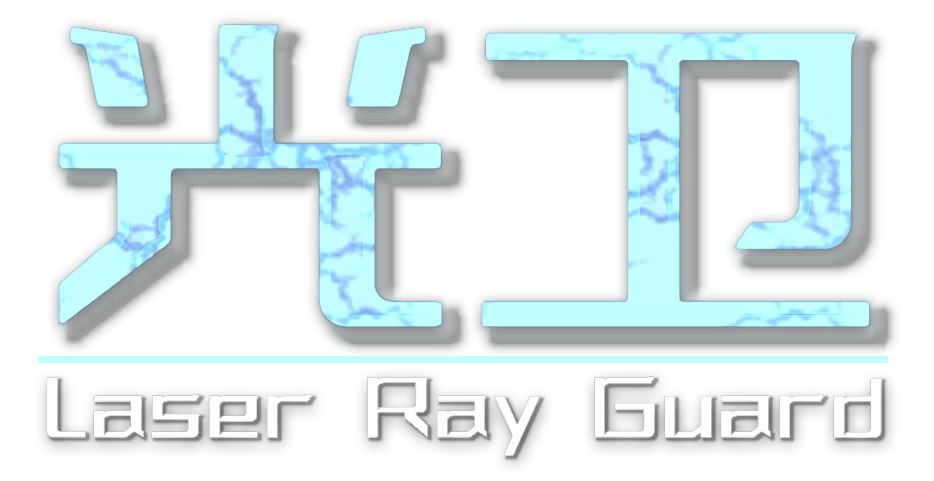
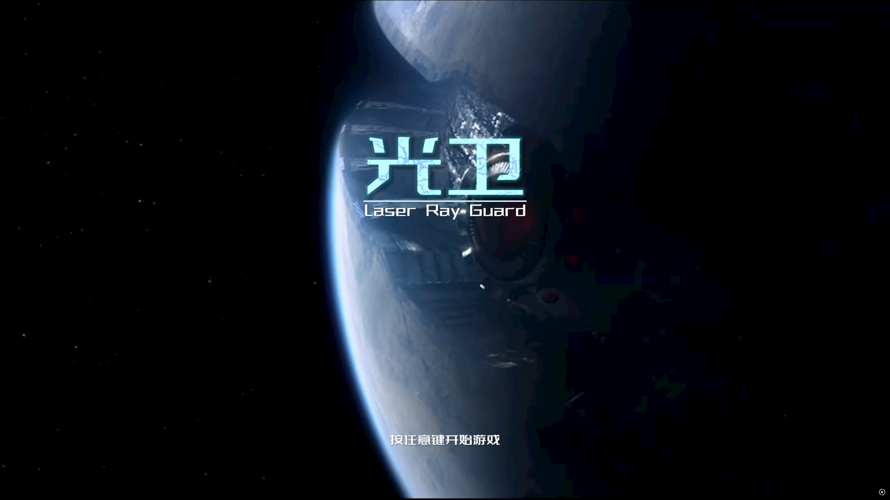

# LaserRayGuard
一个3D塔防游戏Demo，使用Unity3D制作。
# 介绍
### 基于Unity3D的塔防游戏，用于练手，后续可能会更新。
`策略` `塔防` `资源管理` `科幻`
## 游戏主界面

## 游戏内画面
  
  
  
  
# 下载
- 下载游戏Demo **[`LaserRayGuard_Demo_v24.1.zip`](https://github.com/SakeNolingcke/LaserRayGuard/releases/download/v24.1/LaserRayGuard_Demo_v24.1.zip)**
- 下载Unity资源 **[`LaserRayGuard.unitypackage`](https://github.com/SakeNolingcke/LaserRayGuard/releases/download/v24.1/LaserRayGuard.unitypackage)**
